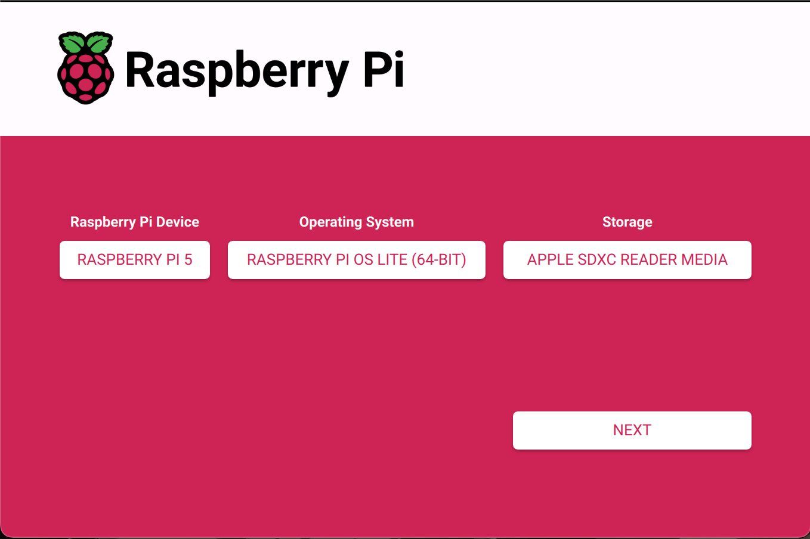

# Self-Hosting a Local Media Server Using a Raspberry Pi 5

This guide explains how to create a private, secure, modern local home video streaming server using a Raspberry Pi 5. It covers setup from OS installation to file transfer, server configuration, and local/remote access.

## Project Summary

This project demonstrates self-hosting a private home media streaming server using a Raspberry Pi 5 and [Jellyfin](https://github.com/jellyfin/jellyfin). It uses Docker for containerization, SSH for remote management, secure configuration, automated mounting, and remote file transfers using macOS.

**Technologies used**: Raspberry Pi OS, Docker, [Jellyfin](https://github.com/jellyfin/jellyfin), SSH, ext4, macOS Terminal

## Project Info

**Created by**: Nicholas Bleeker

**Platform**: Raspberry Pi 5

**Date**: July 17, 2025

**Skills Demonstrated**: Linux CLI, Docker, Remote SSH setup, NAS Integration, Local Media Server Deployment

## Build Guide

### Hardware and Components Used:

- Raspberry Pi 5 (16GB)
- 32GB microSD card (OS storage)
- Samsung T7 Portable SSD (1TB)
- High-Speed USB-C to USB-A cable
- 27W USB-C Power Supply (5.1V 5A)
- Raspberry Pi 5 Active Cooler
- Mac (for configuration and file transfer)
- Flash drive (contains the media we want on the server)


### Step 1: Flash Raspberry Pi OS Lite (64-bit)

1. Download and install the [Raspberry Pi Imager](https://www.raspberrypi.com/software/).
2. Once installed, the Raspberry Pi Imager should look like this:


Set the **Raspberry Pi Device** setting to **Raspberry Pi 5**

To set the **Operating System**, select **Raspberry Pi OS (other)**, and set it to **Raspberry Pi OS Lite (64-bit)**

Set the **Storage** to your **microSD card**

The Raspberry Pi Imager should look similar to:


3. After clicking the **NEXT** button, a prompt will appear asking if you want to apply OS customisation settings. Select **EDIT SETTINGS** and use the following settings:

   *You may change the **hostname** and **username/password** to your preference.*

   #### General:

   **Set hostname**: media-pi.local

   **Set username and password**:

   Username: pi

   Password: raspberry

   **Configure wireless LAN**:

   SSID: (Enter your network's SSID. This can be found by checking your router or by entering your Wi-Fi connection's name)

   Password: (Enter your network's password)

   Wireless LAN country: (Select the country your network is in)

   The **General** tab should look like:

   

   #### Services:

   Check **Enable SSH**

   Bubble **Use password authentication**

   The **Services** tab should look like:

   
4. Once you save your settings, you will be prompted again asking if you would like to apply OS customisation settings. Select **YES** to begin the OS installation.

   *Warning: All existing data on the microSD card will be erased*

### Step 2: Secure Remote Access via SSH

1. Eject the SD card and insert it into the Pi.

   

   Then, power the Pi using the 27W power supply.

   
2. Using the terminal, SSH into the Pi using the following command:

   ```bash
   ssh pi@media-pi.local
   ```

   The terminal will ask you if you want to continue connecting. Type **yes** to continue.

   Now that your Pi device is added to your list of known hosts, SSH back into the Pi:

   ```bash
   ssh pi@media-pi.local
   ```

   Enter your password to finish.

   *If you get a host verification error, run:*

   ```bash
   ssh-keygen -R media-pi.local
   ssh pi@media-pi.local
   ```

   *And retry Step 2.2*

### Step 3: Install and Configure Docker Environment

1. Now that we have SSH access to our Pi, enter the following commands:

   *Please wait for each command to finish installing before moving on to the next.*

   ```bash
   sudo apt update && sudo apt upgrade -y
   curl -sSL https://get.docker.com | sh
   sudo usermod -aG docker pi
   sudo apt install docker-compose -y
   ```

   After Docker finishes installing, reboot the Pi with:

   ```bash
   sudo reboot
   ```

### Step 4: Format and Mount the SSD

1. Plug the external SSD into the Pi using the high-speed USB-C to USB-A cable.

   
2. SSH back into the Pi:

   ```bash
   ssh pi@media-pi.local
   ```
3. Identify the SSD with:

   ```bash
   lsblk
   ```

   Look for something similar too:

   ```bash
   sda1   4M
   └─sda2 931.5G
   ```

   Look for the entry with the largest size. The example above shows that our SSD is labeled as **'sda2'**.

   3. Reformat the SSD to .ext4 with:

   ```bash
   sudo mkfs.ext4 /dev/sda2
   ```

   *.ext4 is very stable for long-term storage, making it ideal for a media server drive. The downside is that Mac or Windows can not read it without third-party software.*
4. Mount the SSD to the Pi using:

   ```bash
   sudo mkdir -p /mnt/media
   sudo mount /dev/sda2 /mnt/media
   sudo chown -R pi:pi /mnt/media
   ```

   Make it auto-mount on startup with:

   ```bash
   sudo nano /etc/fstab
   ```

   Add:

   ```bash
   /dev/sda2 /mnt/media ext4 defaults,nofail 0 0
   ```

   Press **Ctrl + O** to save, then **Ctrl + X** to exit

### Step 5: Set Up Jellyfin with Docker

1. Create a Jellyfin directory with:

   ```bash
   mkdir ~/jellyfin && cd ~/jellyfin
   ```
2. Create a docker-compose file with:

   ```bash
   nano docker-compose.yml
   ```

   And paste the following:

   ```yml
   version: "3.7"

   services:
     jellyfin:
       image: jellyfin/jellyfin
       container_name: jellyfin
       ports:
         - "8096:8096" # HTTP
       volumes:
         - jellyfin_config:/config
         - /mnt/media:/media
       restart: unless-stopped
       devices:
         - /dev/dri:/dev/dri  # For hardware acceleration (if supported)

   volumes:
     jellyfin_config:
   ```

   Save docker-compose.yml by pressing **Ctrl + O**, then **Enter**

   Exit nano with **Ctrl + X**
3. Start Jellyfin with:

   ```bash
   docker-compose up -d
   ```

   Wait a few seconds, then run:

   ```bash
   docker ps
   ```
4. Reboot the Pi and access the Jellyfin Web Interface from a device on the same network (such as your phone or laptop) and go to:

   ```http
   http://media-pi.local:8096
   ```
5. Set up your Jellyfin profile by creating a username and password. Next, add your media library by clicking **Add Media Library**. Choose the content type that best suits your needs. Next, click **folder** and select **/media**. It should look like:
   

### Step 6: Transfer Media from Mac

1. Open a new terminal window to access files on your Mac. Plug in the flash drive containing the video or photo files you want to add to the server, and verify the file path with:

   ```bash
   ls /Volumes/flashDrive/Movies
   ```
2. Copy the files from the flash drive to the Pi with:

   ```bash
   scp -r /Volumes/flashDrive/Movies/ pi@media-pi.local:/mnt/media
   ```

   Wait 1-2 minutes after the files are transferred for them to appear in Jellyfin.

   *If permission is denied on '/mnt/media', SSH into Pi and run:*

   ```bash
   sudo chown -R pi:pi /mnt/media
   ```

   *Then retry the transfer*
3. Confirm the files transferred to the PI with:

   ```bash
   ssh pi@media-pi.local
   ls /mnt/media
   ```

   Jellyfin will now automatically index your videos for playback:

   

## Conclusion

You now have a functioning private media server! You can continue this project by customizing the Jellyfin UI to have a personal touch and even add remote access later to access your home server on the go.

## License

This project is licensed under the [MIT License](LICENSE)
